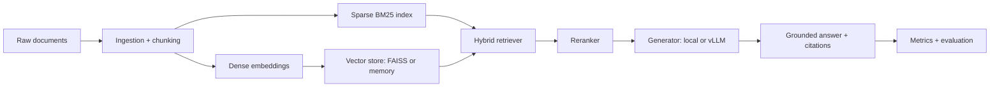

# LLM-RAG Enterprise Assistant Platform

A production-oriented Retrieval-Augmented Generation platform template for enterprise document search and grounded question answering.

This project is intentionally runnable on a laptop while preserving the same boundaries used in larger deployments: ingestion, hybrid retrieval, reranking, generation, evaluation, observability, containerization, and Kubernetes manifests. GPU-backed vLLM, FAISS, LangChain, and PyTorch integrations are exposed through adapters so the system can run in lightweight local mode or be swapped into production infrastructure.

## Project Motivation

I built this project to understand how enterprise RAG systems are structured beyond a basic chatbot demo. The goal is to connect the important production pieces in one codebase: document ingestion, hybrid retrieval, grounded answer generation, evaluation, containerization, and Kubernetes deployment.

## Features

- FastAPI assistant API with `/query`, `/ingest`, `/healthz`, and `/metrics`
- Hybrid dense/sparse retrieval with score fusion and deterministic reranking
- Local extractive generator with source citations for offline demos
- vLLM-compatible generation client for OpenAI-style completions endpoints
- FAISS vector-store adapter with an in-memory fallback
- Document ingestion, chunking, metadata normalization, and JSONL persistence
- Evaluation harness for groundedness, retrieval hit rate, and latency
- Dockerfile and Kubernetes deployment, service, HPA, and config map
- Pytest coverage for chunking, retrieval, and end-to-end query behavior

## Quick Start

```bash
python -m venv .venv
source .venv/bin/activate
pip install -e ".[dev]"
python scripts/ingest_sample.py
uvicorn rag_platform.api.app:create_app --factory --reload
```

Then query the assistant:

```bash
curl -s http://127.0.0.1:8000/query \
  -H "content-type: application/json" \
  -d '{"question":"How does the platform reduce hallucinations?","top_k":4}' | jq
```

Run tests:

```bash
pytest
```

## Architecture



## Configuration

The app reads environment variables with sensible defaults:

| Variable | Default | Purpose |
| --- | --- | --- |
| `RAG_INDEX_PATH` | `./data/index.jsonl` | JSONL document/chunk store |
| `RAG_GENERATOR_MODE` | `local` | `local` or `vllm` |
| `VLLM_BASE_URL` | `http://vllm:8000/v1` | vLLM OpenAI-compatible endpoint |
| `VLLM_MODEL` | `enterprise-llm-7b-lora` | Served model name |
| `RAG_TOP_K` | `5` | Default retrieval depth |
| `RAG_DENSE_WEIGHT` | `0.58` | Hybrid fusion dense weight |

## Production Notes

This repository is a portfolio-ready implementation and deployment skeleton, not a claim that it has processed a real 50M-document corpus from this checkout. The design supports that direction by separating retrieval, serving, and evaluation concerns, and by including Kubernetes manifests and adapters for FAISS and vLLM.

For a real large-scale deployment, add:

- distributed ingestion through Kafka, Spark, or Ray
- sharded FAISS/IVF-PQ or a managed vector database
- model artifacts for the LoRA adapter and quantized serving image
- production tracing through OpenTelemetry
- offline RLHF/DPO training pipelines and signed model registry promotion
